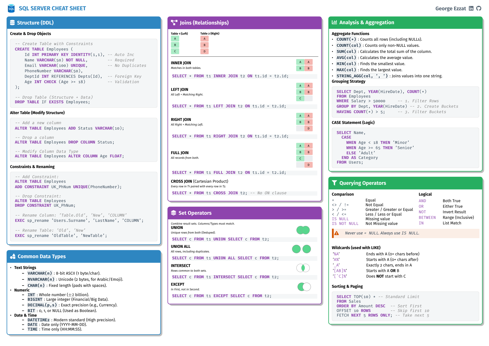

# 🚀 SQL & Data Analysis Portfolio

<div align="center">

<!-- follow me on linkedin -->
<a href="https://www.linkedin.com/comm/mynetwork/discovery-see-all?usecase=PEOPLE_FOLLOWS&followMember=george-ezat" target="_blank">
    
</a>
<!-- follow me on github -->
<a href="https://github.com/george-ezat" target="_blank">
    
</a>
<!-- repo stars -->

<!-- repo last update -->

<!-- repo license -->


</div>

---

## ℹ️ About This Repository
Welcome to my active workshop for mastering Data Science and Engineering. This collection serves as a comprehensive log of my journey through complex data challenges.

It demonstrates my proficiency in **Advanced SQL** (MySQL, PostgreSQL, T-SQL) and **Python** (Pandas) through optimized solutions to problems from top coding platforms.

I solve problems across various environments to ensure adaptability to different SQL dialects and Python libraries.

| **Category** | **Technology** |
| :--- | :--- |
| **Languages** |   |
| **Libraries** |   |
| **Databases** |    |
| **Platforms** |    |


Alongside my problem solutions, I create reference materials to synthesize complex data engineering concepts. Click the image below to view or download the full PDF.

<div align="center">
  <a href="./Resources/GE_sql_cheat_sheet.pdf">
    
  </a>
</div>

---

## 📊 Progress Tracker

I am consistently solving problems across multiple platforms to maintain sharp querying and data manipulation skills. Here is my current progress:

| Platform              |  Easy   | Medium |  Hard  |  Total  |
| :-------------------- | :-----: | :----: | :----: | :-----: |
| **LeetCode**          |   56    |   31   |   7    | **94**  |
| **DataLemur**         |   21    |   19   |   3    | **43**  |
| **HackerRank**        |   40    |   13   |   4    | **57**  |
| **SQL-Practice**      |   25    |   31   |   13   | **69**  |
| **Overall Total**     | **142** | **90** | **27** | **263** |

> ***Note:** Problem counts are updated regularly as I complete new challenges.*

---

## 📂 Repository Structure

My solutions are organized hierarchically by platform and difficulty to ensure easy navigation:

```text
├── 📂 DataLemur
│   ├── 1.Easy
│   ├── 2.Medium
│   └── 3.Hard
│
├── 📂 HackerRank
│   ├── 1.Basic
│   ├── 2.Intermediate
│   └── 3.Advanced
│
├── 📂 LeetCode
│   ├── 1.Easy
│   ├── 2.Medium
│   ├── 3.Hard
│   │
│   ├── Introduction to Pandas
│   ├── Pandas
│   │   ├── 1.Easy
│   │   └── 2.Medium
│   │
│   └── SQL50
│       ├── 1. Select
│       ├── 2. Basic Joins
│       ├── 3. Basic Aggregate Functions
│       ├── 4. Sorting and Grouping
│       ├── 5. Advanced Select and Joins
│       ├── 6. Subqueries
│       └── 7. Advanced String Functions - Regex - Clause
│
└── 📂 Resources
│   └── sql_cheat_sheet.pdf
│
└── 📂 SQL-Practice
    ├── Hospital_DB
    │   ├── 1.Easy
    │   ├── 2.Medium
    │   └── 3.Hard
    └── Northwind_DB
        ├── 1.Easy
        ├── 2.Medium
        └── 3.Hard
```

---

## 🛠️ Core Competencies

This portfolio showcases a diverse range of technical skills, from complex querying to efficient data manipulation.

| Category | Skills Demonstrated |
| :--- | :--- |
| **Advanced SQL** | `Subqueries` • `CTEs` • `Recursive Queries` • `Complex JOINs` • `Window Functions` |
| **Aggregation** | `GROUP BY` & `HAVING` • `String Aggregation` • `Pivot/Unpivot` • Rolling Averages |
| **Data Manipulation** | `Regex` • `Date/Time Functions` • `CASE` Logic • `Data Cleaning` • `Type Casting` |
| **Python (Pandas)** | `DataFrame` Manipulation • `Method Chaining` • `Merging/Joining` • `Data Cleaning` • `Lambda Functions` |
| **Optimization** | `Execution Order Analysis` • `Indexing Strategies` • Query Performance Tuning |

---
## 🌟 Key Features

  * **Multi-Dialect Solutions:** Many SQL problems include solutions for **MySQL**, **PostgreSQL**, and **T-SQL** (SQL Server), highlighting the syntactic differences and best practices for each engine.
  * **Pandas Integration:** Includes Python scripts solving SQL-style problems to demonstrate versatility in data manipulation tools.
  * **Commented Code:** Complex queries are documented with comments explaining the logic, edge cases, or alternative approaches.

---
